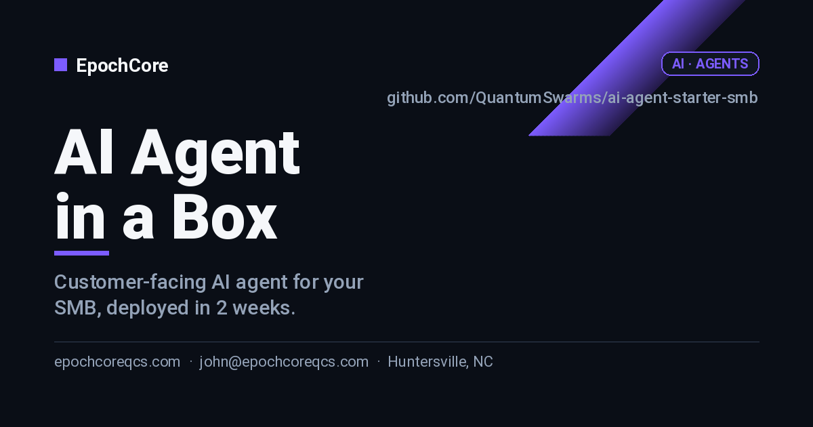

# AI Agent in a Box for SMBs

> Deploy a customer-facing AI agent (support, lead-gen, or ops) for your business in 2 weeks.

---

## Who this is for

SMBs (5–100 employees) in the Charlotte / Lake Norman region who are losing leads to slow response times or burning staff hours on repetitive questions.

## What you get

- A live AI agent answering customer questions on your website, SMS, or email — branded to your business.
- 24/7 lead capture with automatic handoff to a human when the prospect is ready to buy.
- Weekly transcript review + tuning so the agent gets smarter every week.
- Clear ROI dashboard: leads captured, hours saved, response time deltas.

## Pricing

| Tier | Price | What's included |
|---|---|---|
| **Starter** | $4,500 | Single channel, FAQ-only agent, 1 CRM handoff, 30-day tuning. |
| **Growth** | $9,500 | Two channels, lead-qualification logic, A/B tested prompts, 60-day tuning, monthly review. |
| **Operator** | $18,000+ | Full multi-channel, custom integrations, internal staff agent, quarterly business review. |

> Prices are starting points. Final scope confirmed in a free 30-min discovery call. Net-15 invoicing, 50% on signing for fixed-price tiers.

See [`docs/pricing.md`](./docs/pricing.md) for full breakdown, payment terms, and FAQ.

## Engagement timeline

- **Week 1** — Discovery, knowledge ingestion, persona, draft prompts.
- **Week 2** — Internal QA with your team, channel deployment, go-live.
- **Weeks 3–6** — Weekly tuning calls + transcript review.

Full engagement details in [`docs/scope.md`](./docs/scope.md) and [`docs/deliverables.md`](./docs/deliverables.md).

## 📅 Get in touch

| | |
|---|---|
| **Book a call** | [calendar.app.google/BOOKING-PLACEHOLDER](https://calendar.app.google/BOOKING-PLACEHOLDER) — 30-min, free, no commitment |
| **Email** | [john@epochcoreqcs.com](mailto:john@epochcoreqcs.com) |
| **Open an inquiry** | [Engagement Inquiry form](../../issues/new?template=engagement-inquiry.yml) |
| **Service area** | Charlotte / Lake Norman (in-person) · US (remote) |
| **Hours** | Mon–Fri · 9 AM – 2 PM and 4 PM – 7 PM ET |

## How to engage

1. **Open an [Engagement Inquiry](../../issues/new?template=engagement-inquiry.yml)** — takes 2 minutes.
2. We respond within **1 business day** with a 30-min discovery call.
3. After the call, you get a written proposal in 48 hours.

Prefer email? **john@epochcoreqcs.com** with subject `[INQUIRY] ai-agent-starter-smb`.

## About EpochCore

EpochCore LLC is based in **Huntersville, NC**, serving SMBs across the Charlotte / Lake Norman region (and remote nationally). Founder John has shipped infrastructure for quantum computing platforms, IBM Watson.x agents, and enterprise cloud — now bringing that engineering rigor to SMB consulting.

- 🌐 [epochcoreqcs.com](https://epochcoreqcs.com)
- 📧 john@epochcoreqcs.com
- 📍 Huntersville, NC

## Documentation

- [`docs/scope.md`](./docs/scope.md) — what's in and out per tier
- [`docs/pricing.md`](./docs/pricing.md) — full pricing, payment, FAQ
- [`docs/intake-checklist.md`](./docs/intake-checklist.md) — what we need from you at kickoff
- [`docs/deliverables.md`](./docs/deliverables.md) — concrete artifacts you receive
- [`SETUP.md`](./SETUP.md) — internal note for builders editing this repo
- [`CHANGELOG.md`](./CHANGELOG.md) — versioned changes to this offering

## License

This repository is **proprietary** and made public for marketing purposes only. See [`LICENSE`](./LICENSE).
